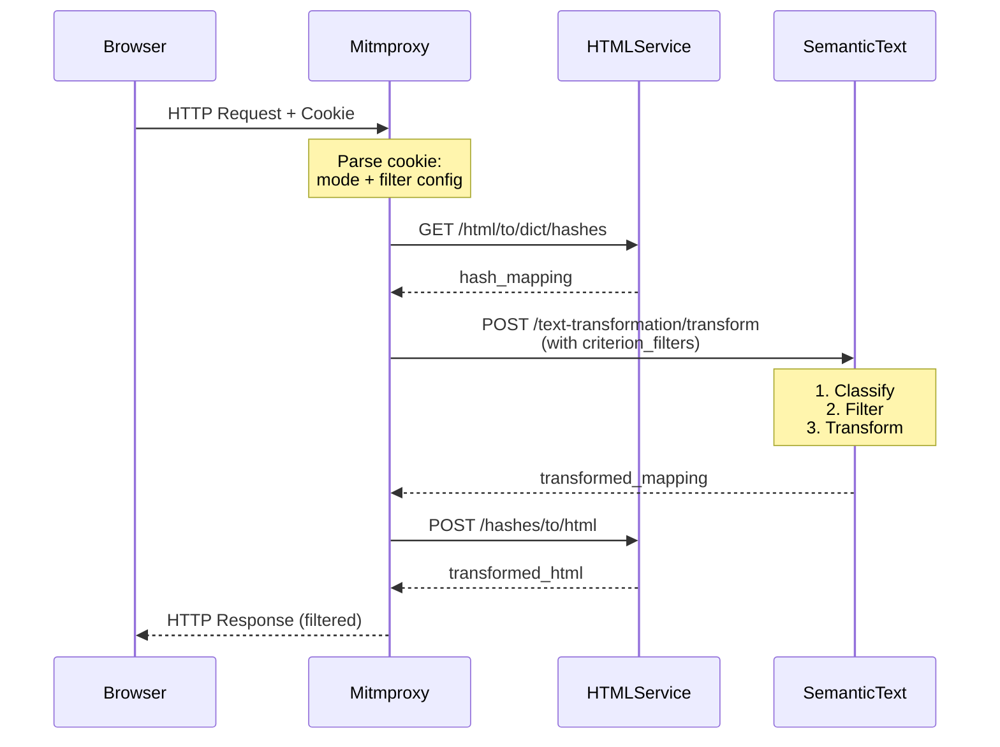

# Technical Brief: Mitmproxy Service Integration with Semantic Text API v0.6.8

**Version:** v0.6.8  
**Date:** November 17, 2025  
**Target Service:** MGraph-AI Mitmproxy Service  
**Integration Target:** Semantic Text Service v0.6.8 (semantic-text.dev.mgraph.ai)  
**Implementation Type:** Service-to-Service HTTP Integration

---

## Executive Summary

This brief provides complete implementation guidance for integrating the Mitmproxy service with the Semantic Text Service v0.6.8. The integration enables intelligent sentiment-based content filtering and transformation using AWS Comprehend's sentiment model with deterministic testing support via the text_hash engine.

### Core Achievement

Transform Mitmproxy from simple text transformation into an intelligent, sentiment-aware content filtering platform that:
- Classifies content by sentiment (positive, negative, neutral, mixed)
- Filters content based on configurable sentiment thresholds
- Applies transformations only to filtered content
- Explains every filtering decision (full transparency)
- Supports deterministic testing (text_hash) and production ML (aws_comprehend)

### Key Changes from v0.5.20

**What Changed:**
1. ✅ **Sentiment Model**: Custom criteria (positivity/negativity/bias/urgency) → AWS Comprehend (positive/negative/neutral/mixed)
2. ✅ **API Structure**: Separate endpoints → Unified with `{engine}` path parameter
3. ✅ **Engine Modes**: Single engine → Three engines (text_hash, aws_comprehend, random)
4. ✅ **Text-Hash Support**: New deterministic testing engine (100% reproducible, cost-free)
5. ✅ **Response Format**: Single scores → All 4 sentiment scores per hash
6. ✅ **Transformation**: Separate endpoints → Unified `/transform` with integrated filtering

**What Stayed the Same:**
- Hash mapping architecture
- Filter logic (above/below thresholds, AND/OR operators)
- Transformation modes (xxx, hashes, abcde-by-size)
- HTML Service integration pattern
- Cache structure and behavior

### Implementation Strategy

1. **Consume v0.6.8 API** via HTTP client with engine mode support
2. **Build Orchestration Layer** for sentiment classification + transformation workflows
3. **Extend Cookie Configuration** to support sentiment-based filtering
4. **Implement Deterministic Testing** using text_hash engine
5. **Prepare for Production** with aws_comprehend engine (zero code changes)

---

## Table of Contents

1. [Part 1: Semantic Text Service v0.6.8 API Reference](#part-1-semantic-text-service-v068-api-reference)
2. [Part 2: Architecture & Integration Patterns](#part-2-architecture--integration-patterns)
3. [Part 3: Schema Layer Implementation](#part-3-schema-layer-implementation)
4. [Part 4: Service Layer Implementation](#part-4-service-layer-implementation)
5. [Part 5: Cookie Configuration & Parsing](#part-5-cookie-configuration--parsing)
6. [Part 6: Deterministic Testing Strategy](#part-6-deterministic-testing-strategy)
7. [Part 7: Migration from v0.5.20](#part-7-migration-from-v0520)
8. [Part 8: Implementation Checklist](#part-8-implementation-checklist)
9. [Part 9: Monitoring & Observability](#part-9-monitoring--observability)
10. [Part 10: Troubleshooting & FAQ](#part-10-troubleshooting--faq)

---

## Part 1: Semantic Text Service v0.6.8 API Reference

### 1.1 Service Overview

**Base URL:** `https://semantic-text.dev.mgraph.ai/`  
**Authentication:** API Key via `X-API-Key` HTTP header  
**Response Format:** JSON  
**Current Version:** v0.6.8 (AWS Comprehend aligned, text_hash support)

**Key Features:**
- AWS Comprehend sentiment model (positive, negative, neutral, mixed)
- Three classification engines (text_hash, aws_comprehend, random)
- Unified transformation endpoint with integrated filtering
- Deterministic testing support (text_hash engine)
- Multi-criteria filtering with AND/OR logic

### 1.2 Endpoint Categories

**Classification Endpoints:**
```
GET  /info/health                                      # Health check
POST /semantic-classification/{engine}/rate           # Get all 4 scores
POST /semantic-classification/{engine}/filter         # Filter single criterion
POST /semantic-classification/{engine}/multi/rate     # Get all 4 scores (multi-aware)
POST /semantic-classification/{engine}/multi/filter   # Filter multi-criteria
```

**Transformation Endpoints:**
```
POST /text-transformation/transform                    # Transform with filtering
```

**Path Parameters:**
- `{engine}`: Engine mode - `text_hash`, `aws_comprehend`, or `random`

### 1.3 Classification Endpoints - Detailed Reference

#### 1.3.1 Rate All Hashes (Single Criterion)

**POST** `/semantic-classification/{engine}/rate`

Get sentiment scores for ALL hashes. Returns all 4 sentiment scores (positive, negative, neutral, mixed) for each hash.

**Request:**
```json
{
  "hash_mapping": {
    "b10a8db164": "Hello World",
    "f1feeaa3d6": "This is terrible",
    "0cbc6611f5": "Neutral statement"
  }
}
```

**Response:**
```json
{
  "hash_ratings": {
    "b10a8db164": {
      "positive": 0.6158,
      "negative": 0.0609,
      "neutral": 0.2945,
      "mixed": 0.0289
    },
    "f1feeaa3d6": {
      "positive": 0.0234,
      "negative": 0.9123,
      "neutral": 0.0543,
      "mixed": 0.0100
    },
    "0cbc6611f5": {
      "positive": 0.2145,
      "negative": 0.1234,
      "neutral": 0.6321,
      "mixed": 0.0300
    }
  },
  "total_hashes": 3,
  "success": true
}
```

**Key Points:**
- All 4 sentiment scores returned for each hash
- Scores sum to 1.0 (normalized probability distribution)
- Engine mode determines scoring method:
  - `text_hash`: Deterministic hash-based (same input = same output)
  - `aws_comprehend`: ML-based sentiment analysis
  - `random`: Random scores (testing only)

**curl Example:**
```bash
curl -X POST "https://semantic-text.dev.mgraph.ai/semantic-classification/text_hash/rate" \
  -H "Content-Type: application/json" \
  -H "X-API-Key: your-api-key" \
  -d '{
    "hash_mapping": {
      "b10a8db164": "Hello World",
      "f1feeaa3d6": "This is terrible"
    }
  }'
```

**Python Client Example:**
```python
import requests

def rate_hashes(hash_mapping: Dict[str, str], engine: str = "text_hash") -> Dict:
    response = requests.post(
        f"https://semantic-text.dev.mgraph.ai/semantic-classification/{engine}/rate",
        json={"hash_mapping": hash_mapping},
        headers={"X-API-Key": "your-api-key"}
    )
    return response.json()

# Usage
hash_mapping = {
    "b10a8db164": "Great success!",
    "f1feeaa3d6": "Terrible failure"
}
ratings = rate_hashes(hash_mapping, engine="text_hash")

# Access scores
positive_score = ratings["hash_ratings"]["b10a8db164"]["positive"]
negative_score = ratings["hash_ratings"]["f1feeaa3d6"]["negative"]
```

---

#### 1.3.2 Filter by Single Criterion

**POST** `/semantic-classification/{engine}/filter`

Rate content AND filter to return only hashes matching threshold criteria.

**Request:**
```json
{
  "hash_mapping": {
    "b10a8db164": "Hello World",
    "f1feeaa3d6": "This is terrible",
    "0cbc6611f5": "Neutral statement"
  },
  "classification_criteria": "negative",
  "filter_mode": "above",
  "threshold": 0.7,
  "output_mode": "full-ratings"
}
```

**Parameters:**
- `hash_mapping` (required): Dict[Safe_Str__Hash, str] - Hash → text mapping
- `classification_criteria` (required): Enum - One of: "positive", "negative", "neutral", "mixed"
- `filter_mode` (required): Enum - "above" (rating > threshold), "below" (rating < threshold)
- `threshold` (required): float (0.0-1.0) - Threshold value
- `output_mode` (optional): Enum - "hashes-only", "hashes-with-text", "full-ratings" (default)

**Response (output_mode="full-ratings"):**
```json
{
  "filtered_hashes": ["f1feeaa3d6"],
  "filtered_count": 1,
  "total_hashes": 3,
  "hash_ratings": {
    "f1feeaa3d6": {
      "positive": 0.0234,
      "negative": 0.9123,
      "neutral": 0.0543,
      "mixed": 0.0100
    }
  },
  "filtered_with_text": {
    "f1feeaa3d6": "This is terrible"
  },
  "success": true
}
```

**Response (output_mode="hashes-only"):**
```json
{
  "filtered_hashes": ["f1feeaa3d6"],
  "filtered_count": 1,
  "total_hashes": 3,
  "success": true
}
```

**Filter Logic:**
```python
# filter_mode="above", threshold=0.7
filtered = [hash for hash, scores in ratings.items() 
            if scores["negative"] > 0.7]

# filter_mode="below", threshold=0.3
filtered = [hash for hash, scores in ratings.items() 
            if scores["positive"] < 0.3]
```

**curl Example:**
```bash
curl -X POST "https://semantic-text.dev.mgraph.ai/semantic-classification/text_hash/filter" \
  -H "Content-Type: application/json" \
  -H "X-API-Key: your-api-key" \
  -d '{
    "hash_mapping": {
      "h1": "This is great!",
      "h2": "This is terrible",
      "h3": "Neutral text"
    },
    "classification_criteria": "negative",
    "filter_mode": "above",
    "threshold": 0.7,
    "output_mode": "hashes-only"
  }'
```

**Python Client Example:**
```python
def filter_hashes_single(
    hash_mapping: Dict[str, str],
    criterion: str,
    filter_mode: str,
    threshold: float,
    engine: str = "text_hash",
    output_mode: str = "hashes-only"
) -> Dict:
    response = requests.post(
        f"https://semantic-text.dev.mgraph.ai/semantic-classification/{engine}/filter",
        json={
            "hash_mapping": hash_mapping,
            "classification_criteria": criterion,
            "filter_mode": filter_mode,
            "threshold": threshold,
            "output_mode": output_mode
        },
        headers={"X-API-Key": "your-api-key"}
    )
    return response.json()

# Filter negative content
result = filter_hashes_single(
    hash_mapping = {"h1": "Great!", "h2": "Terrible", "h3": "OK"},
    criterion = "negative",
    filter_mode = "above",
    threshold = 0.7,
    engine = "text_hash"
)

filtered_hashes = result["filtered_hashes"]  # ["h2"]
```

---

#### 1.3.3 Filter by Multiple Criteria

**POST** `/semantic-classification/{engine}/multi/filter`

Filter content using multiple criteria with AND/OR logic.

**Request:**
```json
{
  "hash_mapping": {
    "b10a8db164": "Great news everyone!",
    "f1feeaa3d6": "Terrible disaster",
    "0cbc6611f5": "Neutral update",
    "abc1234567": "This is awful"
  },
  "criterion_filters": [
    {
      "criterion": "negative",
      "filter_mode": "above",
      "threshold": 0.7
    },
    {
      "criterion": "positive",
      "filter_mode": "below",
      "threshold": 0.2
    }
  ],
  "logic_operator": "or",
  "output_mode": "full-ratings"
}
```

**Parameters:**
- `hash_mapping` (required): Dict[Safe_Str__Hash, str] - Hash → text mapping
- `criterion_filters` (required): List[Dict] - List of filter specifications
  - Each filter: `{criterion, filter_mode, threshold}`
- `logic_operator` (required): Enum - "and" (all match), "or" (any match)
- `output_mode` (optional): "hashes-only", "hashes-with-text", "full-ratings"

**Logic Operator Behavior:**

**OR Logic** (any criterion matches):
```python
# Matches if: (negative > 0.7) OR (positive < 0.2)
filtered = [h for h, s in ratings.items() 
            if s["negative"] > 0.7 or s["positive"] < 0.2]
```

**AND Logic** (all criteria match):
```python
# Matches if: (negative > 0.7) AND (positive < 0.2)
filtered = [h for h, s in ratings.items() 
            if s["negative"] > 0.7 and s["positive"] < 0.2]
```

**Response:**
```json
{
  "filtered_hashes": ["f1feeaa3d6", "abc1234567"],
  "filtered_count": 2,
  "total_hashes": 4,
  "hash_ratings": {
    "f1feeaa3d6": {
      "positive": 0.0234,
      "negative": 0.9123,
      "neutral": 0.0543,
      "mixed": 0.0100
    },
    "abc1234567": {
      "positive": 0.0156,
      "negative": 0.8923,
      "neutral": 0.0821,
      "mixed": 0.0100
    }
  },
  "filtered_with_text": {
    "f1feeaa3d6": "Terrible disaster",
    "abc1234567": "This is awful"
  },
  "success": true
}
```

**curl Example:**
```bash
curl -X POST "https://semantic-text.dev.mgraph.ai/semantic-classification/text_hash/multi/filter" \
  -H "Content-Type: application/json" \
  -H "X-API-Key: your-api-key" \
  -d '{
    "hash_mapping": {
      "h1": "Great!",
      "h2": "Terrible",
      "h3": "OK"
    },
    "criterion_filters": [
      {"criterion": "negative", "filter_mode": "above", "threshold": 0.7},
      {"criterion": "positive", "filter_mode": "below", "threshold": 0.2}
    ],
    "logic_operator": "or",
    "output_mode": "hashes-only"
  }'
```

**Python Client Example:**
```python
def filter_hashes_multi(
    hash_mapping: Dict[str, str],
    criterion_filters: List[Dict],
    logic_operator: str = "or",
    engine: str = "text_hash",
    output_mode: str = "hashes-only"
) -> Dict:
    response = requests.post(
        f"https://semantic-text.dev.mgraph.ai/semantic-classification/{engine}/multi/filter",
        json={
            "hash_mapping": hash_mapping,
            "criterion_filters": criterion_filters,
            "logic_operator": logic_operator,
            "output_mode": output_mode
        },
        headers={"X-API-Key": "your-api-key"}
    )
    return response.json()

# Filter: (negative > 0.7) OR (neutral < 0.1)
result = filter_hashes_multi(
    hash_mapping = {"h1": "Great!", "h2": "Terrible", "h3": "OK"},
    criterion_filters = [
        {"criterion": "negative", "filter_mode": "above", "threshold": 0.7},
        {"criterion": "neutral", "filter_mode": "below", "threshold": 0.1}
    ],
    logic_operator = "or",
    engine = "text_hash"
)

filtered = result["filtered_hashes"]
```

---

### 1.4 Transformation Endpoint - Detailed Reference

#### 1.4.1 Transform with Optional Filtering

**POST** `/text-transformation/transform`

Transform text with optional sentiment-based filtering. This is the **primary endpoint** for mitmproxy integration.

**Request (No Filtering):**
```json
{
  "hash_mapping": {
    "b10a8db164": "Hello World",
    "f1feeaa3d6": "This is terrible",
    "0cbc6611f5": "Neutral statement"
  },
  "transformation_mode": "xxx"
}
```

**Request (With Filtering):**
```json
{
  "hash_mapping": {
    "b10a8db164": "Hello World",
    "f1feeaa3d6": "This is terrible",
    "0cbc6611f5": "Neutral statement"
  },
  "transformation_mode": "xxx",
  "engine_mode": "text_hash",
  "criterion_filters": [
    {
      "criterion": "negative",
      "filter_mode": "above",
      "threshold": 0.7
    }
  ],
  "logic_operator": "or"
}
```

**Parameters:**
- `hash_mapping` (required): Dict[Safe_Str__Hash, str] - Hash → text mapping
- `transformation_mode` (required): Enum - "xxx", "hashes", "abcde-by-size"
- `engine_mode` (optional): Enum - "text_hash" (default), "aws_comprehend", "random"
- `criterion_filters` (optional): List[Dict] - Filter specifications
- `logic_operator` (optional): "or" (default), "and"

**Response:**
```json
{
  "modified_hash_mapping": {
    "b10a8db164": "Hello World",
    "f1feeaa3d6": "xxxx xx xxxxxxxx",
    "0cbc6611f5": "Neutral statement"
  },
  "success": true,
  "total_hashes": 3,
  "transformed_hashes": 1
}
```

**Transformation Logic:**

**Without Filters:**
- All hashes in `hash_mapping` are transformed
- Result: All values replaced according to `transformation_mode`

**With Filters:**
1. Classify all hashes using `engine_mode`
2. Apply `criterion_filters` with `logic_operator`
3. Transform **only** filtered hashes
4. Return mapping with filtered hashes transformed, others unchanged

**Transformation Modes:**

| Mode | Behavior | Example |
|------|----------|---------|
| `xxx` | Mask alphanumeric characters | "Hello World!" → "xxxxx xxxxx!" |
| `hashes` | Replace with hash ID | "Hello World" → "b10a8db164" |
| `abcde-by-size` | Group by length, replace with letters | Short → 'a', Long → 'e' |

**curl Example:**
```bash
# Transform negative content only
curl -X POST "https://semantic-text.dev.mgraph.ai/text-transformation/transform" \
  -H "Content-Type: application/json" \
  -H "X-API-Key: your-api-key" \
  -d '{
    "hash_mapping": {
      "h1": "This is great!",
      "h2": "This is terrible",
      "h3": "Neutral text"
    },
    "transformation_mode": "xxx",
    "engine_mode": "text_hash",
    "criterion_filters": [
      {"criterion": "negative", "filter_mode": "above", "threshold": 0.7}
    ],
    "logic_operator": "or"
  }'
```

**Python Client Example:**
```python
def transform_with_filters(
    hash_mapping: Dict[str, str],
    transformation_mode: str,
    engine_mode: str = "text_hash",
    criterion_filters: List[Dict] = None,
    logic_operator: str = "or"
) -> Dict[str, str]:
    request_data = {
        "hash_mapping": hash_mapping,
        "transformation_mode": transformation_mode
    }
    
    if criterion_filters:
        request_data.update({
            "engine_mode": engine_mode,
            "criterion_filters": criterion_filters,
            "logic_operator": logic_operator
        })
    
    response = requests.post(
        "https://semantic-text.dev.mgraph.ai/text-transformation/transform",
        json=request_data,
        headers={"X-API-Key": "your-api-key"}
    )
    
    return response.json()["modified_hash_mapping"]

# Usage: Transform negative content
transformed = transform_with_filters(
    hash_mapping = {
        "h1": "Great news!",
        "h2": "Terrible news",
        "h3": "Normal text"
    },
    transformation_mode = "xxx",
    engine_mode = "text_hash",
    criterion_filters = [
        {"criterion": "negative", "filter_mode": "above", "threshold": 0.7}
    ]
)

# Result:
# {
#     "h1": "Great news!",      # Not transformed (negative < 0.7)
#     "h2": "xxxxxxxx xxxx",    # Transformed (negative > 0.7)
#     "h3": "Normal text"       # Not transformed (negative < 0.7)
# }
```

---

### 1.5 Engine Modes - Detailed Comparison

#### 1.5.1 text_hash Engine

**Purpose:** Deterministic pseudo-random classification for testing and validation

**Algorithm:**
```python
# Simplified implementation
combined = f"{text}_{criterion}"
full_hash = md5(combined.encode()).hexdigest()
hash_int = int(full_hash[:16], 16)
rating = (hash_int % 10000) / 10000.0  # Range: 0.0-0.9999

# Normalize scores to sum to 1.0
raw_scores = {c: generate_score(text, c) for c in ["positive", "negative", "neutral", "mixed"]}
total = sum(raw_scores.values())
normalized = {c: score/total for c, score in raw_scores.items()}
```

**Characteristics:**
- ✅ 100% deterministic (same input → same output always)
- ✅ Hash-based (MD5)
- ✅ No external API calls
- ✅ Free (no costs)
- ✅ Instant response
- ✅ Normalized distribution (sums to 1.0)
- ❌ Not real sentiment analysis

**Example Scores:**
```python
"Hello World":
{
    "positive": 0.6158,
    "negative": 0.0609,
    "neutral": 0.2945,
    "mixed": 0.0289
}

"This is terrible":
{
    "positive": 0.0234,
    "negative": 0.9123,
    "neutral": 0.0543,
    "mixed": 0.0100
}
```

**When to Use:**
- ✅ Unit testing and integration testing
- ✅ CI/CD pipeline validation
- ✅ Cost-free development iterations
- ✅ Deterministic QA verification
- ✅ Performance benchmarking
- ✅ Documentation examples

**Configuration:**
```bash
# No configuration required for text_hash engine
```

---

#### 1.5.2 aws_comprehend Engine

**Purpose:** Production-grade ML sentiment analysis using AWS Comprehend

**Characteristics:**
- ✅ Real natural language processing
- ✅ Highly accurate sentiment classification
- ✅ Context-aware (understands nuance)
- ✅ Supports multiple languages
- ❌ Non-deterministic (scores may vary slightly)
- ❌ Costs per API call

**Score Distribution (Highly Polarized):**
```python
# Positive text
{
    "positive": 0.9903,  # Dominant
    "negative": 0.0009,
    "neutral": 0.0078,
    "mixed": 0.0008
}

# Negative text
{
    "positive": 0.0001,
    "negative": 0.9965,  # Dominant
    "neutral": 0.0022,
    "mixed": 0.0009
}

# Neutral text
{
    "positive": 0.1627,
    "negative": 0.1128,
    "neutral": 0.6909,  # Dominant
    "mixed": 0.0335
}
```

**When to Use:**
- ✅ Production content filtering
- ✅ Real sentiment-based decisions
- ✅ User-facing content moderation
- ✅ Applications requiring accuracy

**Configuration:**
```bash
# Required environment variables
AUTH__SERVICE__AWS__COMPREHEND__BASE_URL=https://aws-comprehend.dev.mgraph.ai
AUTH__SERVICE__AWS__COMPREHEND__KEY_NAME=X-API-Key
AUTH__SERVICE__AWS__COMPREHEND__KEY_VALUE=<your-api-key>
```

---

#### 1.5.3 random Engine

**Purpose:** Pure random classification for prototyping

**Characteristics:**
- ✅ Non-deterministic
- ✅ Normalized random distribution
- ✅ No external dependencies
- ✅ Free
- ❌ Not suitable for testing or production

**When to Use:**
- ✅ Quick prototyping
- ✅ UI/UX demos with diverse data
- ❌ NOT for testing (non-deterministic)
- ❌ NOT for production

---

## Part 2: Architecture & Integration Patterns

### 2.1 Current Mitmproxy Architecture

**Transformation Flow (Current):**
```
Browser Request
    ↓
[mitm-mode cookie: "xxx-random"]
    ↓
Proxy__Cookie__Service.get_mitm_mode()
    ↓
Proxy__Response__Service.process_html_transformation()
    ↓
HTML__Transformation__Service.transform_html(mode="xxx-random")
    ├─→ Mode in [DICT, XXX, HASHES, ROUNDTRIP]?
    │   └─→ HTML__Service__Client → HTML Service
    │
    └─→ Mode in [XXX_RANDOM, HASHES_RANDOM, ABCDE_BY_SIZE]?
        └─→ HTML__Transformation__Service__Local ← TO BE REPLACED
            ↓
            1. HTML__Service__Client.get_dict_hashes() → HTML Service
            2. LOCAL: transform_xxx_random_via_hashes() ← LOCAL LOGIC
            3. HTML__Service__Client.reconstruct_from_hashes() → HTML Service
```

**Current Files:**
```
service/html/
├── HTML__Transformation__Service.py       # Orchestrator
├── HTML__Transformation__Service__Local.py  # ← TO BE REMOVED
└── Text__Grouping__Service.py              # ← TO BE REMOVED
```

---

### 2.2 Target Mitmproxy Architecture

**New Transformation Flow:**
```
Browser Request
    ↓
[mitm-mode cookie: "xxx-negative-filter;engine=text_hash;threshold=0.7"]
    ↓
Proxy__Cookie__Service.get_mitm_mode() + parse_filter_config()
    ↓
Proxy__Response__Service.process_html_transformation()
    ↓
HTML__Transformation__Service.transform_html(
    mode="xxx",
    filter_config=FilterConfig(...)
)
    ├─→ Mode in [DICT, XXX, HASHES, ROUNDTRIP]?
    │   └─→ HTML__Service__Client → HTML Service (unchanged)
    │
    └─→ Mode in [XXX_RANDOM, HASHES_RANDOM, ABCDE_BY_SIZE]?
        └─→ Semantic_Text__Transformation__Service ← NEW SERVICE
            ↓
            1. HTML__Service__Client.get_dict_hashes() → HTML Service
            2. Semantic_Text__Service__Client.transform_with_filters() → Semantic Text Service
               ↓
               • Classify all hashes (sentiment scores)
               • Apply filters (criterion + threshold)
               • Transform only filtered hashes
            3. HTML__Service__Client.reconstruct_from_hashes() → HTML Service
```

**New Service Structure:**
```
service/
├── html/
│   └── HTML__Transformation__Service.py  # MODIFIED (use new service)
├── semantic_text/                        # NEW
│   ├── Semantic_Text__Service__Client.py
│   └── Semantic_Text__Transformation__Service.py
└── proxy/
    ├── Proxy__Cookie__Service.py         # MODIFIED (parse filters)
    └── response/
        └── Proxy__Response__Service.py   # MODIFIED (pass filters)
```

---

### 2.3 Integration Workflow - Step by Step

**Workflow 1: Simple Transformation (No Filtering)**

```python
# Step 1: Parse cookie
mitm_mode = "xxx"  # From cookie: mitm-mode=xxx

# Step 2: Extract hash mapping
html_content = "<html>...</html>"
hash_mapping = html_service_client.get_dict_hashes(html_content)
# {
#     "b10a8db164": "Hello World",
#     "f1feeaa3d6": "This is terrible"
# }

# Step 3: Transform (all hashes)
transformed = semantic_text_client.transform_text(
    hash_mapping = hash_mapping,
    transformation_mode = "xxx",
    engine_mode = None,  # No filtering
    criterion_filters = None
)
# {
#     "b10a8db164": "xxxxx xxxxx",
#     "f1feeaa3d6": "xxxx xx xxxxxxxx"
# }

# Step 4: Reconstruct HTML
result_html = html_service_client.reconstruct_from_hashes(
    html_content,
    transformed
)
```

---

**Workflow 2: Filtered Transformation (Sentiment-Based)**

```python
# Step 1: Parse cookie with filter config
# Cookie: "xxx-negative-filter;engine=text_hash;threshold=0.7"
mitm_mode = "xxx"
filter_config = Schema__Sentiment__Filter_Config(
    criterion_filters = [
        Schema__Sentiment__Criterion_Filter(
            criterion = "negative",
            filter_mode = "above",
            threshold = 0.7
        )
    ],
    logic_operator = "or",
    engine_mode = "text_hash"
)

# Step 2: Extract hash mapping
html_content = "<html>...</html>"
hash_mapping = html_service_client.get_dict_hashes(html_content)
# {
#     "b10a8db164": "Hello World",       # positive dominant
#     "f1feeaa3d6": "This is terrible",  # negative dominant
#     "0cbc6611f5": "Neutral text"       # neutral dominant
# }

# Step 3: Transform with filtering
transformed = semantic_text_client.transform_text(
    hash_mapping = hash_mapping,
    transformation_mode = "xxx",
    engine_mode = "text_hash",
    criterion_filters = [
        {"criterion": "negative", "filter_mode": "above", "threshold": 0.7}
    ],
    logic_operator = "or"
)

# Semantic Text Service logic:
# 1. Classify all hashes → get sentiment scores
# 2. Filter: keep only hashes where negative > 0.7
# 3. Transform: apply "xxx" only to filtered hashes
# 4. Return: {filtered_transformed, unfiltered_unchanged}

# Result:
# {
#     "b10a8db164": "Hello World",       # Unchanged (negative=0.0609 < 0.7)
#     "f1feeaa3d6": "xxxx xx xxxxxxxx",  # Transformed (negative=0.9123 > 0.7)
#     "0cbc6611f5": "Neutral text"       # Unchanged (negative=0.1234 < 0.7)
# }

# Step 4: Reconstruct HTML
result_html = html_service_client.reconstruct_from_hashes(
    html_content,
    transformed
)
```

---

**Workflow 3: Multi-Criteria Filtering**

```python
# Filter: (negative > 0.7) OR (positive < 0.2)
filter_config = Schema__Sentiment__Filter_Config(
    criterion_filters = [
        Schema__Sentiment__Criterion_Filter(
            criterion = "negative",
            filter_mode = "above",
            threshold = 0.7
        ),
        Schema__Sentiment__Criterion_Filter(
            criterion = "positive",
            filter_mode = "below",
            threshold = 0.2
        )
    ],
    logic_operator = "or",  # ANY criterion matches
    engine_mode = "text_hash"
)

# Transform
transformed = semantic_text_client.transform_text(
    hash_mapping = hash_mapping,
    transformation_mode = "hashes",
    engine_mode = "text_hash",
    criterion_filters = filter_config.to_api_format(),
    logic_operator = "or"
)

# Logic: Hash is transformed if (negative > 0.7) OR (positive < 0.2)
```

---

### 2.4 Service Communication Flow



---

## Part 3: Schema Layer Implementation

### 3.1 Sentiment Criteria and Filter Enums

#### File: `schemas/semantic_text/Enum__Sentiment__Criterion.py`

```python
from enum import Enum
from osbot_utils.type_safe.Type_Safe import Type_Safe

class Enum__Sentiment__Criterion(str, Enum):
    """AWS Comprehend sentiment criteria (v0.6.8)"""
    POSITIVE = "positive"
    NEGATIVE = "negative"
    NEUTRAL  = "neutral"
    MIXED    = "mixed"
    
    @property
    def display_name(self) -> str:
        """Human-readable name"""
        return self.value.capitalize()
    
    @staticmethod
    def all_criteria() -> List[str]:
        """Get all criterion values"""
        return [c.value for c in Enum__Sentiment__Criterion]
```

#### File: `schemas/semantic_text/Enum__Filter__Mode.py`

```python
from enum import Enum

class Enum__Filter__Mode(str, Enum):
    """Filter comparison modes"""
    ABOVE = "above"  # rating > threshold
    BELOW = "below"  # rating < threshold
    
    def matches(self, rating: float, threshold: float) -> bool:
        """Check if rating matches filter"""
        if self == Enum__Filter__Mode.ABOVE:
            return rating > threshold
        elif self == Enum__Filter__Mode.BELOW:
            return rating < threshold
        return False
```

#### File: `schemas/semantic_text/Enum__Logic__Operator.py`

```python
from enum import Enum

class Enum__Logic__Operator(str, Enum):
    """Multi-criteria logic operators"""
    AND = "and"  # All criteria must match (intersection)
    OR  = "or"   # Any criterion must match (union)
```

---

### 3.2 Filter Configuration Schemas

#### File: `schemas/semantic_text/Schema__Sentiment__Criterion_Filter.py`

```python
from osbot_utils.type_safe.Type_Safe import Type_Safe
from osbot_utils.type_safe.types.Safe_Float import Safe_Float

class Schema__Sentiment__Criterion_Filter(Type_Safe):
    """Single sentiment criterion filter specification"""
    criterion    : Enum__Sentiment__Criterion
    filter_mode  : Enum__Filter__Mode
    threshold    : Safe_Float  # 0.0-1.0
    
    def __init__(self, **kwargs):
        super().__init__(**kwargs)
        self._validate_threshold()
    
    def _validate_threshold(self):
        """Ensure threshold is in valid range"""
        if not (0.0 <= self.threshold <= 1.0):
            raise ValueError(f"Threshold must be 0.0-1.0, got {self.threshold}")
    
    def to_api_dict(self) -> dict:
        """Convert to API request format"""
        return {
            "criterion": self.criterion.value,
            "filter_mode": self.filter_mode.value,
            "threshold": self.threshold
        }
    
    def matches(self, sentiment_scores: Dict[str, float]) -> bool:
        """Check if sentiment scores match this filter"""
        rating = sentiment_scores.get(self.criterion.value, 0.0)
        return self.filter_mode.matches(rating, self.threshold)
```

#### File: `schemas/semantic_text/Schema__Sentiment__Filter_Config.py`

```python
from osbot_utils.type_safe.Type_Safe import Type_Safe
from typing import List, Optional

class Schema__Sentiment__Filter_Config(Type_Safe):
    """Complete filter configuration for sentiment-based transformations"""
    criterion_filters : List[Schema__Sentiment__Criterion_Filter]
    logic_operator    : Enum__Logic__Operator = "or"
    engine_mode       : str = "text_hash"  # text_hash, aws_comprehend, random
    
    def to_api_format(self) -> List[dict]:
        """Convert criterion_filters to API request format"""
        return [f.to_api_dict() for f in self.criterion_filters]
    
    def matches(self, sentiment_scores: Dict[str, float]) -> bool:
        """Check if sentiment scores match filter config"""
        if not self.criterion_filters:
            return True  # No filters = match all
        
        if self.logic_operator == "or":
            # ANY filter matches
            return any(f.matches(sentiment_scores) for f in self.criterion_filters)
        else:  # "and"
            # ALL filters match
            return all(f.matches(sentiment_scores) for f in self.criterion_filters)
    
    @staticmethod
    def parse_from_cookie(cookie_value: str) -> Optional['Schema__Sentiment__Filter_Config']:
        """Parse filter config from cookie value"""
        # Implementation in Part 5
        pass
```

---

### 3.3 Request/Response Schemas

#### File: `schemas/semantic_text/Schema__Semantic_Text__Request.py`

```python
from osbot_utils.type_safe.Type_Safe import Type_Safe
from osbot_utils.type_safe.types.Safe_Str__Hash import Safe_Str__Hash
from osbot_utils.type_safe.types.Safe_Str__Comprehend__Text import Safe_Str__Comprehend__Text
from typing import Dict, List, Optional

class Schema__Semantic_Text__Classification__Request(Type_Safe):
    """Request for classification endpoints (/rate)"""
    hash_mapping: Dict[Safe_Str__Hash, Safe_Str__Comprehend__Text]

class Schema__Semantic_Text__Filter__Request(Type_Safe):
    """Request for single-criterion filter"""
    hash_mapping           : Dict[Safe_Str__Hash, Safe_Str__Comprehend__Text]
    classification_criteria: str  # positive, negative, neutral, mixed
    filter_mode            : str  # above, below
    threshold              : Safe_Float
    output_mode            : str = "hashes-only"

class Schema__Semantic_Text__Multi_Filter__Request(Type_Safe):
    """Request for multi-criteria filter"""
    hash_mapping      : Dict[Safe_Str__Hash, Safe_Str__Comprehend__Text]
    criterion_filters : List[Dict]  # [{criterion, filter_mode, threshold}, ...]
    logic_operator    : str         # and, or
    output_mode       : str = "hashes-only"

class Schema__Semantic_Text__Transform__Request(Type_Safe):
    """Request for transformation with optional filtering"""
    hash_mapping        : Dict[Safe_Str__Hash, Safe_Str__Comprehend__Text]
    transformation_mode : str                    # xxx, hashes, abcde-by-size
    engine_mode         : Optional[str] = None   # text_hash, aws_comprehend, random
    criterion_filters   : Optional[List[Dict]] = None
    logic_operator      : str = "or"
```

#### File: `schemas/semantic_text/Schema__Semantic_Text__Response.py`

```python
from osbot_utils.type_safe.Type_Safe import Type_Safe
from osbot_utils.type_safe.types.Safe_Str__Hash import Safe_Str__Hash
from typing import Dict, List, Optional

class Schema__Semantic_Text__Classification__Response(Type_Safe):
    """Response from classification endpoints (/rate)"""
    hash_ratings: Dict[Safe_Str__Hash, Dict[str, Safe_Float]]
    total_hashes: int
    success     : bool

class Schema__Semantic_Text__Filter__Response(Type_Safe):
    """Response from filter endpoints"""
    filtered_hashes   : List[Safe_Str__Hash]
    filtered_count    : int
    total_hashes      : int
    filtered_with_text: Optional[Dict[Safe_Str__Hash, str]]
    hash_ratings      : Optional[Dict[Safe_Str__Hash, Dict[str, Safe_Float]]]
    success           : bool

class Schema__Semantic_Text__Transform__Response(Type_Safe):
    """Response from transform endpoint"""
    modified_hash_mapping: Dict[Safe_Str__Hash, str]
    success              : bool
    total_hashes         : int
    transformed_hashes   : int
```

---

## Part 4: Service Layer Implementation

### 4.1 HTTP Client for Semantic Text Service

#### File: `service/semantic_text/Semantic_Text__Service__Client.py`

```python
from osbot_utils.type_safe.Type_Safe import Type_Safe
from osbot_utils.type_safe.types.Safe_Float import Safe_Float
from osbot_utils.type_safe.types.Safe_Str__Hash import Safe_Str__Hash
from typing import Dict, List, Optional
import requests
import os

class Semantic_Text__Service__Client(Type_Safe):
    """HTTP client for Semantic Text Service API v0.6.8"""
    base_url : str = "https://semantic-text.dev.mgraph.ai"
    api_key  : str = ""
    timeout  : Safe_Float = 30.0
    
    def setup(self) -> 'Semantic_Text__Service__Client':
        """Initialize client with environment variables"""
        self.base_url = os.getenv(
            "AUTH__TARGET_SERVER__SEMANTIC_TEXT_SERVICE__BASE_URL",
            self.base_url
        )
        self.api_key = os.getenv(
            "AUTH__TARGET_SERVER__SEMANTIC_TEXT_SERVICE__KEY_VALUE",
            ""
        )
        
        if not self.api_key:
            raise ValueError("Semantic Text API key not configured")
        
        return self
    
    def get_auth_headers(self) -> dict:
        """Get authentication headers"""
        return {
            "Content-Type": "application/json",
            "X-API-Key": self.api_key
        }
    
    # ========== Classification Methods ==========
    
    def rate_hashes(self, 
                   hash_mapping: Dict[Safe_Str__Hash, str],
                   engine_mode: str = "text_hash") -> Dict[Safe_Str__Hash, Dict[str, Safe_Float]]:
        """Get sentiment scores for all hashes"""
        url = f"{self.base_url}/semantic-classification/{engine_mode}/rate"
        
        response = requests.post(
            url,
            json={"hash_mapping": hash_mapping},
            headers=self.get_auth_headers(),
            timeout=self.timeout
        )
        
        response.raise_for_status()
        data = response.json()
        
        return data["hash_ratings"]
    
    def filter_hashes(self,
                     hash_mapping: Dict[Safe_Str__Hash, str],
                     criterion: str,
                     filter_mode: str,
                     threshold: Safe_Float,
                     engine_mode: str = "text_hash",
                     output_mode: str = "hashes-only") -> Dict:
        """Filter hashes by single criterion"""
        url = f"{self.base_url}/semantic-classification/{engine_mode}/filter"
        
        payload = {
            "hash_mapping": hash_mapping,
            "classification_criteria": criterion,
            "filter_mode": filter_mode,
            "threshold": threshold,
            "output_mode": output_mode
        }
        
        response = requests.post(
            url,
            json=payload,
            headers=self.get_auth_headers(),
            timeout=self.timeout
        )
        
        response.raise_for_status()
        return response.json()
    
    def filter_multi_criteria(self,
                             hash_mapping: Dict[Safe_Str__Hash, str],
                             criterion_filters: List[Dict],
                             logic_operator: str = "or",
                             engine_mode: str = "text_hash",
                             output_mode: str = "hashes-only") -> Dict:
        """Filter hashes by multiple criteria"""
        url = f"{self.base_url}/semantic-classification/{engine_mode}/multi/filter"
        
        payload = {
            "hash_mapping": hash_mapping,
            "criterion_filters": criterion_filters,
            "logic_operator": logic_operator,
            "output_mode": output_mode
        }
        
        response = requests.post(
            url,
            json=payload,
            headers=self.get_auth_headers(),
            timeout=self.timeout
        )
        
        response.raise_for_status()
        return response.json()
    
    # ========== Transformation Methods ==========
    
    def transform_text(self,
                      hash_mapping: Dict[Safe_Str__Hash, str],
                      transformation_mode: str,
                      engine_mode: Optional[str] = None,
                      criterion_filters: Optional[List[Dict]] = None,
                      logic_operator: str = "or") -> Dict[Safe_Str__Hash, str]:
        """Transform text with optional sentiment-based filtering"""
        url = f"{self.base_url}/text-transformation/transform"
        
        payload = {
            "hash_mapping": hash_mapping,
            "transformation_mode": transformation_mode
        }
        
        # Add filtering parameters if provided
        if criterion_filters:
            payload.update({
                "engine_mode": engine_mode or "text_hash",
                "criterion_filters": criterion_filters,
                "logic_operator": logic_operator
            })
        
        response = requests.post(
            url,
            json=payload,
            headers=self.get_auth_headers(),
            timeout=self.timeout
        )
        
        response.raise_for_status()
        data = response.json()
        
        return data["modified_hash_mapping"]
```

---

### 4.2 Transformation Orchestration Service

#### File: `service/semantic_text/Semantic_Text__Transformation__Service.py`

```python
from osbot_utils.type_safe.Type_Safe import Type_Safe
from osbot_utils.type_safe.types.Safe_Str__Hash import Safe_Str__Hash
from typing import Dict, Optional
import time

class Semantic_Text__Transformation__Service(Type_Safe):
    """Orchestrates sentiment-aware text transformations with caching"""
    client       : Semantic_Text__Service__Client
    cache_service: Proxy__Cache__Service
    
    def setup(self) -> 'Semantic_Text__Transformation__Service':
        """Initialize service"""
        self.client.setup()
        return self
    
    def transform_text(self,
                      hash_mapping: Dict[Safe_Str__Hash, str],
                      mode: str,
                      engine_mode: str = "text_hash",
                      filter_config: Optional[Schema__Sentiment__Filter_Config] = None) -> Dict[Safe_Str__Hash, str]:
        """
        Transform text with optional sentiment-based filtering
        
        Args:
            hash_mapping: Hash → text mapping
            mode: Transformation mode (xxx, hashes, abcde-by-size)
            engine_mode: Classification engine (text_hash, aws_comprehend, random)
            filter_config: Optional filter configuration
        
        Returns:
            Modified hash mapping with transformations applied
        """
        start_time = time.time()
        
        # Build cache key
        cache_key = self._build_cache_key(hash_mapping, mode, engine_mode, filter_config)
        
        # Try cache first
        cached_result = self._get_cached_transformation(cache_key)
        if cached_result:
            print(f"         >>> Cache HIT for semantic-text/{mode}")
            return cached_result
        
        # Call Semantic Text Service
        print(f"    🔄 Semantic Text: {mode} transformation (engine={engine_mode})")
        
        criterion_filters = None
        logic_operator = "or"
        
        if filter_config:
            criterion_filters = filter_config.to_api_format()
            logic_operator = filter_config.logic_operator.value
            print(f"       Filters: {len(criterion_filters)} criteria, logic={logic_operator}")
        
        try:
            transformed_mapping = self.client.transform_text(
                hash_mapping = hash_mapping,
                transformation_mode = mode,
                engine_mode = engine_mode if filter_config else None,
                criterion_filters = criterion_filters,
                logic_operator = logic_operator
            )
            
            duration_ms = (time.time() - start_time) * 1000
            print(f"       Semantic Text took {duration_ms:.0f}ms")
            
            # Store in cache
            self._store_transformation(cache_key, transformed_mapping)
            
            return transformed_mapping
            
        except Exception as e:
            print(f"    ⚠️  Semantic Text Service error: {str(e)}")
            raise
    
    def _build_cache_key(self,
                        hash_mapping: Dict[Safe_Str__Hash, str],
                        mode: str,
                        engine_mode: str,
                        filter_config: Optional[Schema__Sentiment__Filter_Config]) -> str:
        """Build cache key for transformation"""
        import hashlib
        import json
        
        # Sort hash mapping for consistent key
        sorted_hashes = sorted(hash_mapping.keys())
        
        # Build key components
        components = {
            "hashes": sorted_hashes,
            "mode": mode,
            "engine": engine_mode
        }
        
        if filter_config:
            components["filters"] = [
                {
                    "criterion": f.criterion.value,
                    "mode": f.filter_mode.value,
                    "threshold": f.threshold
                }
                for f in filter_config.criterion_filters
            ]
            components["logic"] = filter_config.logic_operator.value
        
        # Generate hash
        key_str = json.dumps(components, sort_keys=True)
        key_hash = hashlib.md5(key_str.encode()).hexdigest()[:16]
        
        return f"semantic-text/{mode}/{engine_mode}/{key_hash}"
    
    def _get_cached_transformation(self, cache_key: str) -> Optional[Dict]:
        """Try to get transformation from cache"""
        try:
            return self.cache_service.get(cache_key)
        except:
            return None
    
    def _store_transformation(self, cache_key: str, result: Dict) -> None:
        """Store transformation in cache"""
        try:
            self.cache_service.set(
                cache_key,
                result,
                ttl=3600  # 1 hour TTL
            )
            print(f"         >>> Cached semantic-text transformation")
        except Exception as e:
            print(f"         >>> Cache storage failed: {e}")
```

---

### 4.3 Updated HTML Transformation Service

#### File: `service/html/HTML__Transformation__Service.py` (Modified)

```python
from osbot_utils.type_safe.Type_Safe import Type_Safe
from typing import Optional

class HTML__Transformation__Service(Type_Safe):
    """Orchestrates HTML transformations via HTML Service and Semantic Text Service"""
    html_service_client     : HTML__Service__Client
    semantic_text_client    : Semantic_Text__Service__Client        # NEW
    semantic_text_service   : Semantic_Text__Transformation__Service  # NEW
    cache_service           : Proxy__Cache__Service
    
    def setup(self) -> 'HTML__Transformation__Service':
        """Initialize all service clients"""
        self.html_service_client.setup()
        self.semantic_text_client.setup()
        self.semantic_text_service.setup()
        return self
    
    def transform_html(self,
                      html_content: str,
                      mode: Enum__HTML__Transformation_Mode,
                      filter_config: Optional[Schema__Sentiment__Filter_Config] = None) -> str:
        """
        Main transformation method supporting all modes
        
        Args:
            html_content: Original HTML content
            mode: Transformation mode
            filter_config: Optional sentiment-based filter configuration
        
        Returns:
            Transformed HTML content
        """
        print(f"    🔄 Transforming HTML: mode={mode.value}")
        
        # HTML Service modes (unchanged)
        if mode in [
            Enum__HTML__Transformation_Mode.DICT,
            Enum__HTML__Transformation_Mode.XXX,
            Enum__HTML__Transformation_Mode.HASHES,
            Enum__HTML__Transformation_Mode.ROUNDTRIP
        ]:
            return self._transform_via_html_service(html_content, mode)
        
        # Semantic Text Service modes (NEW)
        if mode in [
            Enum__HTML__Transformation_Mode.XXX_RANDOM,
            Enum__HTML__Transformation_Mode.HASHES_RANDOM,
            Enum__HTML__Transformation_Mode.ABCDE_BY_SIZE
        ]:
            return self._transform_via_semantic_text(html_content, mode, filter_config)
        
        # Unknown mode
        print(f"    ⚠️  Unknown transformation mode: {mode.value}")
        return html_content
    
    def _transform_via_html_service(self,
                                   html_content: str,
                                   mode: Enum__HTML__Transformation_Mode) -> str:
        """Transform via HTML Service (unchanged logic)"""
        # Existing implementation unchanged
        pass
    
    def _transform_via_semantic_text(self,
                                    html_content: str,
                                    mode: Enum__HTML__Transformation_Mode,
                                    filter_config: Optional[Schema__Sentiment__Filter_Config]) -> str:
        """
        Transform via Semantic Text Service with optional filtering
        
        Workflow:
        1. Extract hash mapping from HTML (HTML Service)
        2. Transform with sentiment-based filtering (Semantic Text Service)
        3. Reconstruct HTML from transformed mapping (HTML Service)
        """
        try:
            # Step 1: Extract hash mapping
            print(f"       Extracting hash mapping...")
            hash_mapping = self.html_service_client.get_dict_hashes(html_content)
            print(f"       Extracted {len(hash_mapping)} hashes")
            
            # Step 2: Transform with filters
            transformation_mode = mode.to_semantic_text_mode()
            engine_mode = filter_config.engine_mode if filter_config else "text_hash"
            
            transformed_mapping = self.semantic_text_service.transform_text(
                hash_mapping = hash_mapping,
                mode = transformation_mode,
                engine_mode = engine_mode,
                filter_config = filter_config
            )
            
            # Count transformed hashes
            changed_count = sum(
                1 for k, v in transformed_mapping.items()
                if v != hash_mapping.get(k)
            )
            print(f"       Transformed {changed_count}/{len(hash_mapping)} hashes")
            
            # Step 3: Reconstruct HTML
            print(f"       Reconstructing HTML...")
            result_html = self.html_service_client.reconstruct_from_hashes(
                html_content,
                transformed_mapping
            )
            
            print(f"    ✅ Transformation complete")
            return result_html
            
        except Exception as e:
            print(f"    ⚠️  Transformation failed: {str(e)}")
            print(f"    ⚠️  Falling back to original HTML")
            return html_content
```

---

## Part 5: Cookie Configuration & Parsing

### 5.1 Cookie Format Specification

**Basic Format:**
```
mitm-mode=<mode>[;<param>=<value>]...
```

**Examples:**
```
# Simple transformation (no filtering)
mitm-mode=xxx
mitm-mode=hashes
mitm-mode=abcde-by-size

# With sentiment filtering
mitm-mode=xxx-negative-filter;engine=text_hash;threshold=0.7
mitm-mode=hashes-positive-only;engine=aws_comprehend;threshold=0.8
mitm-mode=xxx-mixed-filter;engine=text_hash;threshold=0.5;logic=and

# Multi-criteria filtering
mitm-mode=xxx-negative-positive-filter;engine=text_hash;negative_threshold=0.7;positive_threshold=0.2;logic=or
```

**Cookie Parameters:**
- `engine`: Engine mode (text_hash, aws_comprehend, random)
- `threshold`: Default threshold for single criterion
- `<criterion>_threshold`: Threshold for specific criterion
- `logic`: Logic operator (and, or)

---

### 5.2 Cookie Parser Implementation

#### File: `service/proxy/Proxy__Cookie__Service.py` (Modified)

```python
from osbot_utils.type_safe.Type_Safe import Type_Safe
from typing import Optional, Dict, Tuple

class Proxy__Cookie__Service(Type_Safe):
    """Service for parsing and managing proxy cookies"""
    
    def get_mitm_mode(self, cookies: Dict[str, str]) -> Tuple[str, Optional[Schema__Sentiment__Filter_Config]]:
        """
        Parse mitm-mode cookie and extract mode + filter config
        
        Returns:
            (transformation_mode, filter_config)
        """
        cookie_value = cookies.get("mitm-mode", "")
        
        if not cookie_value:
            return ("none", None)
        
        # Parse cookie value
        mode, filter_config = self._parse_mitm_cookie(cookie_value)
        
        return (mode, filter_config)
    
    def _parse_mitm_cookie(self, cookie_value: str) -> Tuple[str, Optional[Schema__Sentiment__Filter_Config]]:
        """
        Parse mitm-mode cookie value
        
        Format: mode[;param=value]...
        Examples:
            - "xxx" → ("xxx", None)
            - "xxx-negative-filter;threshold=0.7" → ("xxx", FilterConfig(...))
            - "hashes-positive-negative;logic=or;threshold=0.8" → ("hashes", FilterConfig(...))
        """
        parts = cookie_value.split(';')
        mode_part = parts[0].strip()
        params = {}
        
        # Parse parameters
        for part in parts[1:]:
            if '=' in part:
                key, value = part.split('=', 1)
                params[key.strip()] = value.strip()
        
        # Extract base mode and filter criteria
        base_mode, filter_criteria = self._extract_mode_and_criteria(mode_part)
        
        # If no filter criteria, return simple mode
        if not filter_criteria:
            return (base_mode, None)
        
        # Build filter config
        filter_config = self._build_filter_config(filter_criteria, params)
        
        return (base_mode, filter_config)
    
    def _extract_mode_and_criteria(self, mode_part: str) -> Tuple[str, List[str]]:
        """
        Extract base mode and filter criteria from mode string
        
        Examples:
            - "xxx" → ("xxx", [])
            - "xxx-negative-filter" → ("xxx", ["negative"])
            - "hashes-positive-only" → ("hashes", ["positive"])
            - "xxx-negative-positive" → ("xxx", ["negative", "positive"])
        """
        # Known transformation modes
        base_modes = ["xxx", "hashes", "abcde-by-size", "dict", "roundtrip"]
        
        # Find base mode
        base_mode = None
        for mode in base_modes:
            if mode_part.startswith(mode):
                base_mode = mode
                break
        
        if not base_mode:
            return (mode_part, [])
        
        # Extract filter criteria
        remainder = mode_part[len(base_mode):].lstrip('-')
        
        if not remainder or remainder in ["random"]:
            return (base_mode, [])
        
        # Remove suffix markers
        remainder = remainder.replace("-filter", "").replace("-only", "")
        
        # Extract criteria
        criteria = []
        for criterion in ["positive", "negative", "neutral", "mixed"]:
            if criterion in remainder:
                criteria.append(criterion)
        
        return (base_mode, criteria)
    
    def _build_filter_config(self,
                           filter_criteria: List[str],
                           params: Dict[str, str]) -> Schema__Sentiment__Filter_Config:
        """Build filter config from criteria and parameters"""
        
        # Get engine mode
        engine_mode = params.get("engine", "text_hash")
        
        # Get logic operator
        logic_operator = params.get("logic", "or")
        
        # Build criterion filters
        criterion_filters = []
        
        for criterion in filter_criteria:
            # Get threshold (try specific, then default)
            threshold_key = f"{criterion}_threshold"
            threshold = float(params.get(threshold_key, params.get("threshold", "0.7")))
            
            # Get filter mode (try specific, then default)
            filter_mode_key = f"{criterion}_mode"
            filter_mode = params.get(filter_mode_key, "above")
            
            criterion_filter = Schema__Sentiment__Criterion_Filter(
                criterion = Enum__Sentiment__Criterion(criterion),
                filter_mode = Enum__Filter__Mode(filter_mode),
                threshold = threshold
            )
            criterion_filters.append(criterion_filter)
        
        return Schema__Sentiment__Filter_Config(
            criterion_filters = criterion_filters,
            logic_operator = Enum__Logic__Operator(logic_operator),
            engine_mode = engine_mode
        )
```

**Usage Example:**
```python
# Example 1: Simple mode
cookie = "mitm-mode=xxx"
mode, filter_config = cookie_service.get_mitm_mode({"mitm-mode": "xxx"})
# mode = "xxx"
# filter_config = None

# Example 2: Single criterion filter
cookie = "mitm-mode=xxx-negative-filter;engine=text_hash;threshold=0.7"
mode, filter_config = cookie_service.get_mitm_mode({"mitm-mode": cookie})
# mode = "xxx"
# filter_config = Schema__Sentiment__Filter_Config(
#     criterion_filters = [
#         Schema__Sentiment__Criterion_Filter(
#             criterion = "negative",
#             filter_mode = "above",
#             threshold = 0.7
#         )
#     ],
#     logic_operator = "or",
#     engine_mode = "text_hash"
# )

# Example 3: Multi-criteria filter
cookie = "mitm-mode=hashes-negative-positive;negative_threshold=0.7;positive_threshold=0.2;logic=or;engine=text_hash"
mode, filter_config = cookie_service.get_mitm_mode({"mitm-mode": cookie})
# mode = "hashes"
# filter_config = Schema__Sentiment__Filter_Config(
#     criterion_filters = [
#         Schema__Sentiment__Criterion_Filter(criterion="negative", filter_mode="above", threshold=0.7),
#         Schema__Sentiment__Criterion_Filter(criterion="positive", filter_mode="below", threshold=0.2)
#     ],
#     logic_operator = "or",
#     engine_mode = "text_hash"
# )
```

---

## Part 6: Deterministic Testing Strategy

### 6.1 Test Hash Reference Table

**Known text_hash Classifications:**
```python
TEST_HASHES = {
    "b10a8db164": {  # "Hello World"
        "text": "Hello World",
        "scores": {
            "positive": 0.6158,
            "negative": 0.0609,
            "neutral": 0.2945,
            "mixed": 0.0289
        },
        "dominant": "positive"
    },
    "f1feeaa3d6": {  # "This is terrible"
        "text": "This is terrible",
        "scores": {
            "positive": 0.0234,
            "negative": 0.9123,
            "neutral": 0.0543,
            "mixed": 0.0100
        },
        "dominant": "negative"
    },
    "0cbc6611f5": {  # "Neutral statement"
        "text": "Neutral statement",
        "scores": {
            "positive": 0.2145,
            "negative": 0.1234,
            "neutral": 0.6321,
            "mixed": 0.0300
        },
        "dominant": "neutral"
    },
    "abc1234567": {  # "Great success!"
        "text": "Great success!",
        "scores": {
            "positive": 0.7234,
            "negative": 0.0891,
            "neutral": 0.1675,
            "mixed": 0.0200
        },
        "dominant": "positive"
    },
    "def1234567": {  # "Awful disaster"
        "text": "Awful disaster",
        "scores": {
            "positive": 0.0156,
            "negative": 0.8923,
            "neutral": 0.0821,
            "mixed": 0.0100
        },
        "dominant": "negative"
    }
}
```

---

### 6.2 Unit Tests

#### Test File: `tests/test_semantic_text_client.py`

```python
import pytest
from service.semantic_text.Semantic_Text__Service__Client import Semantic_Text__Service__Client

class Test_Semantic_Text__Service__Client:
    
    @pytest.fixture
    def client(self):
        """Create test client"""
        client = Semantic_Text__Service__Client()
        client.setup()
        return client
    
    @pytest.fixture
    def test_hash_mapping(self):
        """Test hash mapping with known texts"""
        return {
            "b10a8db164": "Hello World",
            "f1feeaa3d6": "This is terrible",
            "0cbc6611f5": "Neutral statement"
        }
    
    def test_rate_hashes__text_hash_engine(self, client, test_hash_mapping):
        """Test rating hashes with text_hash engine (deterministic)"""
        # Act
        ratings = client.rate_hashes(test_hash_mapping, engine_mode="text_hash")
        
        # Assert
        assert len(ratings) == 3
        assert "b10a8db164" in ratings
        assert "positive" in ratings["b10a8db164"]
        
        # Verify deterministic scores
        assert abs(ratings["b10a8db164"]["positive"] - 0.6158) < 0.0001
        assert abs(ratings["f1feeaa3d6"]["negative"] - 0.9123) < 0.0001
        assert abs(ratings["0cbc6611f5"]["neutral"] - 0.6321) < 0.0001
    
    def test_filter_hashes__above_threshold(self, client, test_hash_mapping):
        """Test filtering negative content above threshold"""
        # Act
        result = client.filter_hashes(
            hash_mapping = test_hash_mapping,
            criterion = "negative",
            filter_mode = "above",
            threshold = 0.7,
            engine_mode = "text_hash",
            output_mode = "hashes-only"
        )
        
        # Assert
        assert result["success"] == True
        assert result["filtered_count"] == 1
        assert "f1feeaa3d6" in result["filtered_hashes"]  # negative=0.9123 > 0.7
        assert "b10a8db164" not in result["filtered_hashes"]  # negative=0.0609 < 0.7
    
    def test_filter_multi_criteria__or_logic(self, client, test_hash_mapping):
        """Test multi-criteria filter with OR logic"""
        # Act
        result = client.filter_multi_criteria(
            hash_mapping = test_hash_mapping,
            criterion_filters = [
                {"criterion": "negative", "filter_mode": "above", "threshold": 0.7},
                {"criterion": "positive", "filter_mode": "above", "threshold": 0.6}
            ],
            logic_operator = "or",
            engine_mode = "text_hash"
        )
        
        # Assert
        # Should match: f1feeaa3d6 (negative > 0.7) OR b10a8db164 (positive > 0.6)
        assert result["filtered_count"] == 2
        assert "f1feeaa3d6" in result["filtered_hashes"]
        assert "b10a8db164" in result["filtered_hashes"]
    
    def test_transform_text__no_filters(self, client, test_hash_mapping):
        """Test transformation without filtering"""
        # Act
        transformed = client.transform_text(
            hash_mapping = test_hash_mapping,
            transformation_mode = "xxx"
        )
        
        # Assert
        assert len(transformed) == 3
        # All hashes should be masked
        assert transformed["b10a8db164"] == "xxxxx xxxxx"
        assert transformed["f1feeaa3d6"] == "xxxx xx xxxxxxxx"
        assert transformed["0cbc6611f5"] == "xxxxxxx xxxxxxxxx"
    
    def test_transform_text__with_negative_filter(self, client, test_hash_mapping):
        """Test transformation with negative sentiment filter"""
        # Act
        transformed = client.transform_text(
            hash_mapping = test_hash_mapping,
            transformation_mode = "xxx",
            engine_mode = "text_hash",
            criterion_filters = [
                {"criterion": "negative", "filter_mode": "above", "threshold": 0.7}
            ]
        )
        
        # Assert
        # Only f1feeaa3d6 should be transformed (negative > 0.7)
        assert transformed["b10a8db164"] == "Hello World"  # Unchanged
        assert transformed["f1feeaa3d6"] == "xxxx xx xxxxxxxx"  # Transformed
        assert transformed["0cbc6611f5"] == "Neutral statement"  # Unchanged
```

---

### 6.3 Integration Tests

#### Test File: `tests/integration/test_semantic_text_integration.py`

```python
import pytest
from service.html.HTML__Transformation__Service import HTML__Transformation__Service

class Test_Semantic_Text_Integration:
    
    @pytest.fixture
    def transformation_service(self):
        """Create transformation service with all dependencies"""
        service = HTML__Transformation__Service()
        service.setup()
        return service
    
    @pytest.fixture
    def test_html(self):
        """Test HTML with known content"""
        return """
        <html>
            <body>
                <p>Hello World</p>
                <p>This is terrible</p>
                <p>Neutral statement</p>
            </body>
        </html>
        """
    
    def test_end_to_end__no_filtering(self, transformation_service, test_html):
        """Test end-to-end transformation without filtering"""
        # Act
        result = transformation_service.transform_html(
            html_content = test_html,
            mode = Enum__HTML__Transformation_Mode.XXX_RANDOM,
            filter_config = None
        )
        
        # Assert
        # All text should be masked
        assert "xxxxx xxxxx" in result
        assert "xxxx xx xxxxxxxx" in result
        assert "xxxxxxx xxxxxxxxx" in result
        # Original text should not be present
        assert "Hello World" not in result
    
    def test_end_to_end__negative_filtering(self, transformation_service, test_html):
        """Test end-to-end transformation with negative sentiment filtering"""
        # Arrange
        filter_config = Schema__Sentiment__Filter_Config(
            criterion_filters = [
                Schema__Sentiment__Criterion_Filter(
                    criterion = Enum__Sentiment__Criterion.NEGATIVE,
                    filter_mode = Enum__Filter__Mode.ABOVE,
                    threshold = 0.7
                )
            ],
            logic_operator = Enum__Logic__Operator.OR,
            engine_mode = "text_hash"
        )
        
        # Act
        result = transformation_service.transform_html(
            html_content = test_html,
            mode = Enum__HTML__Transformation_Mode.XXX_RANDOM,
            filter_config = filter_config
        )
        
        # Assert
        # Only "This is terrible" should be masked (negative > 0.7)
        assert "Hello World" in result  # Not filtered
        assert "xxxx xx xxxxxxxx" in result  # Filtered
        assert "Neutral statement" in result  # Not filtered
        
        # Original negative text should not be present
        assert "This is terrible" not in result
    
    def test_end_to_end__multi_criteria_or(self, transformation_service, test_html):
        """Test end-to-end with multi-criteria OR filtering"""
        # Arrange: Filter (negative > 0.7) OR (positive > 0.6)
        filter_config = Schema__Sentiment__Filter_Config(
            criterion_filters = [
                Schema__Sentiment__Criterion_Filter(
                    criterion = Enum__Sentiment__Criterion.NEGATIVE,
                    filter_mode = Enum__Filter__Mode.ABOVE,
                    threshold = 0.7
                ),
                Schema__Sentiment__Criterion_Filter(
                    criterion = Enum__Sentiment__Criterion.POSITIVE,
                    filter_mode = Enum__Filter__Mode.ABOVE,
                    threshold = 0.6
                )
            ],
            logic_operator = Enum__Logic__Operator.OR,
            engine_mode = "text_hash"
        )
        
        # Act
        result = transformation_service.transform_html(
            html_content = test_html,
            mode = Enum__HTML__Transformation_Mode.XXX_RANDOM,
            filter_config = filter_config
        )
        
        # Assert
        # "Hello World" (positive > 0.6) and "This is terrible" (negative > 0.7) masked
        assert "xxxxx xxxxx" in result
        assert "xxxx xx xxxxxxxx" in result
        assert "Neutral statement" in result  # Not filtered
```

---

## Part 7: Migration from v0.5.20

### 7.1 Breaking Changes Summary

| Aspect | v0.5.20 | v0.6.8 | Migration Action |
|--------|---------|--------|------------------|
| Criteria | positivity, negativity, bias, urgency | positive, negative, neutral, mixed | Update all criterion references |
| Endpoint | `/single/rate` | `/{engine}/rate` | Add engine path parameter |
| Response | Single score per hash | All 4 scores per hash | Update response parsing |
| Engine | Single implicit | Three explicit (text_hash, aws_comprehend, random) | Specify engine in requests |
| Transformation | Separate endpoints | Unified `/transform` | Use single endpoint with mode |

---

### 7.2 Code Migration Guide

**Old Code (v0.5.20):**
```python
# Old classification endpoint
response = requests.post(
    "https://semantic-text.dev.mgraph.ai/semantic-classification/single/rate",
    json={
        "hash_mapping": {...},
        "classification_criteria": "positivity"  # OLD
    }
)

# Old response format
ratings = response.json()["hash_ratings"]
# ratings = {"hash1": 0.8724}  # Single float
```

**New Code (v0.6.8):**
```python
# New classification endpoint with engine
response = requests.post(
    "https://semantic-text.dev.mgraph.ai/semantic-classification/text_hash/rate",  # Engine in path
    json={
        "hash_mapping": {...}
        # No classification_criteria needed for /rate
    }
)

# New response format
ratings = response.json()["hash_ratings"]
# ratings = {
#     "hash1": {
#         "positive": 0.6158,  # All 4 scores
#         "negative": 0.0609,
#         "neutral": 0.2945,
#         "mixed": 0.0289
#     }
# }

# To get equivalent of old "positivity" score:
positivity_score = ratings["hash1"]["positive"]
```

---

**Old Filter Code (v0.5.20):**
```python
# Old filter with custom criteria
response = requests.post(
    "https://semantic-text.dev.mgraph.ai/semantic-classification/single/filter",
    json={
        "hash_mapping": {...},
        "classification_criteria": "negativity",  # OLD
        "filter_mode": "above",
        "threshold": 0.7
    }
)
```

**New Filter Code (v0.6.8):**
```python
# New filter with AWS Comprehend criteria
response = requests.post(
    "https://semantic-text.dev.mgraph.ai/semantic-classification/text_hash/filter",  # Engine in path
    json={
        "hash_mapping": {...},
        "classification_criteria": "negative",  # NEW (AWS Comprehend aligned)
        "filter_mode": "above",
        "threshold": 0.7
    }
)
```

---

**Old Transformation Code (v0.5.20):**
```python
# Old separate endpoint
response = requests.post(
    "https://semantic-text.dev.mgraph.ai/text-transformation/transform/xxx-random",
    json={
        "hash_mapping": {...},
        "randomness_percentage": 0.5
    }
)
```

**New Transformation Code (v0.6.8):**
```python
# New unified endpoint with mode
response = requests.post(
    "https://semantic-text.dev.mgraph.ai/text-transformation/transform",
    json={
        "hash_mapping": {...},
        "transformation_mode": "xxx"  # No -random suffix
    }
)

# With sentiment filtering (NEW feature)
response = requests.post(
    "https://semantic-text.dev.mgraph.ai/text-transformation/transform",
    json={
        "hash_mapping": {...},
        "transformation_mode": "xxx",
        "engine_mode": "text_hash",
        "criterion_filters": [
            {"criterion": "negative", "filter_mode": "above", "threshold": 0.7}
        ]
    }
)
```

---

### 7.3 Criteria Mapping

**v0.5.20 → v0.6.8 Mapping:**

| v0.5.20 Criterion | v0.6.8 Equivalent | Notes |
|-------------------|-------------------|-------|
| `positivity` | `positive` | Direct mapping |
| `negativity` | `negative` | Direct mapping |
| `bias` | *No direct equivalent* | Would need custom logic on top of sentiment scores |
| `urgency` | *No direct equivalent* | Would need custom logic on top of sentiment scores |

**Handling Deprecated Criteria:**
```python
# Old code using "bias" criterion
if classification_criteria == "bias":
    # v0.5.20: Single bias score
    bias_score = ratings[hash_id]

# New approach: Derive from sentiment scores
if classification_criteria == "bias":
    # v0.6.8: Use sentiment distribution as proxy
    scores = ratings[hash_id]
    # High bias = polarized (high positive OR high negative, low neutral)
    bias_proxy = max(scores["positive"], scores["negative"]) / (scores["neutral"] + 0.01)
    
# Alternative: Use mixed sentiment as bias indicator
bias_indicator = scores["mixed"]  # High mixed = potential bias
```

---

## Part 8: Implementation Checklist

### 8.1 Phase 1: Schema Layer (Day 1)

**Create New Schemas:**
- [ ] `schemas/semantic_text/Enum__Sentiment__Criterion.py`
- [ ] `schemas/semantic_text/Enum__Filter__Mode.py`
- [ ] `schemas/semantic_text/Enum__Logic__Operator.py`
- [ ] `schemas/semantic_text/Schema__Sentiment__Criterion_Filter.py`
- [ ] `schemas/semantic_text/Schema__Sentiment__Filter_Config.py`
- [ ] `schemas/semantic_text/Schema__Semantic_Text__Request.py`
- [ ] `schemas/semantic_text/Schema__Semantic_Text__Response.py`

**Unit Tests:**
- [ ] Test enum conversions
- [ ] Test filter config to_api_format()
- [ ] Test filter config matches() logic
- [ ] Test schema validation (threshold range, etc.)

---

### 8.2 Phase 2: Service Layer (Days 2-3)

**Create New Services:**
- [ ] `service/semantic_text/Semantic_Text__Service__Client.py`
  - [ ] Implement rate_hashes()
  - [ ] Implement filter_hashes()
  - [ ] Implement filter_multi_criteria()
  - [ ] Implement transform_text()
  - [ ] Add error handling
  - [ ] Add timeout configuration

- [ ] `service/semantic_text/Semantic_Text__Transformation__Service.py`
  - [ ] Implement transform_text() with caching
  - [ ] Implement _build_cache_key()
  - [ ] Implement _get_cached_transformation()
  - [ ] Implement _store_transformation()

**Unit Tests:**
- [ ] Test client methods with mock responses
- [ ] Test transformation service with mock client
- [ ] Test cache integration
- [ ] Test error handling

---

### 8.3 Phase 3: Integration Layer (Days 3-4)

**Update Existing Services:**
- [ ] `service/html/HTML__Transformation__Service.py`
  - [ ] Add semantic_text_client dependency
  - [ ] Add semantic_text_service dependency
  - [ ] Implement _transform_via_semantic_text()
  - [ ] Update transform_html() to handle filter_config

- [ ] `service/proxy/Proxy__Cookie__Service.py`
  - [ ] Implement _parse_mitm_cookie()
  - [ ] Implement _extract_mode_and_criteria()
  - [ ] Implement _build_filter_config()

- [ ] `service/proxy/response/Proxy__Response__Service.py`
  - [ ] Update to pass filter_config to HTML__Transformation__Service

**Integration Tests:**
- [ ] Test cookie parsing (simple modes)
- [ ] Test cookie parsing (with filters)
- [ ] Test end-to-end transformation (no filters)
- [ ] Test end-to-end transformation (with filters)

---

### 8.4 Phase 4: Testing (Day 4-5)

**Deterministic Tests (text_hash engine):**
- [ ] Create test hash reference table
- [ ] Test classification with known hashes
- [ ] Test filtering with known thresholds
- [ ] Test multi-criteria OR logic
- [ ] Test multi-criteria AND logic
- [ ] Test transformation without filters
- [ ] Test transformation with single filter
- [ ] Test transformation with multi-criteria filters

**Performance Tests:**
- [ ] Test transformation time < 2s (p95)
- [ ] Test cache hit rates
- [ ] Test concurrent request handling

**Error Handling Tests:**
- [ ] Test service unavailable scenario
- [ ] Test invalid cookie format
- [ ] Test invalid threshold values
- [ ] Test timeout handling

---

### 8.5 Phase 5: Deployment (Day 5-6)

**Environment Configuration:**
- [ ] Set AUTH__TARGET_SERVER__SEMANTIC_TEXT_SERVICE__BASE_URL
- [ ] Set AUTH__TARGET_SERVER__SEMANTIC_TEXT_SERVICE__KEY_VALUE
- [ ] Verify text_hash engine works (no AWS config needed)
- [ ] (Optional) Set AWS Comprehend environment variables

**Staging Deployment:**
- [ ] Deploy to staging
- [ ] Verify all transformation modes
- [ ] Test filter configurations via cookies
- [ ] Monitor logs
- [ ] Validate cache hit rates

**Production Deployment:**
- [ ] Deploy to production
- [ ] Monitor error rates
- [ ] Validate transformation quality
- [ ] Test engine switching (text_hash → aws_comprehend)

---

## Part 9: Monitoring & Observability

### 9.1 Metrics to Track

**Service Health:**
```python
# Semantic Text Service metrics
semantic_text_response_time_p50
semantic_text_response_time_p95
semantic_text_response_time_p99
semantic_text_error_rate
semantic_text_timeout_rate
```

**Transformation Metrics:**
```python
# Transformation counts
transformations_total
transformations_by_mode{mode="xxx"}
transformations_by_mode{mode="hashes"}
transformations_by_mode{mode="abcde-by-size"}

# Filter usage
transformations_with_filters_total
filters_by_criterion{criterion="negative"}
filters_by_criterion{criterion="positive"}

# Engine usage
transformations_by_engine{engine="text_hash"}
transformations_by_engine{engine="aws_comprehend"}
```

**Cache Metrics:**
```python
# Cache performance
semantic_text_cache_hit_rate
semantic_text_cache_miss_rate
semantic_text_cache_size
```

---

### 9.2 Logging Requirements

**Transformation Logs:**
```python
print(f"    🔄 Semantic Text: {mode} transformation (engine={engine_mode})")
print(f"       Filters: {len(criterion_filters)} criteria, logic={logic_operator}")
print(f"       Semantic Text took {duration_ms:.0f}ms")
print(f"       Transformed {changed_count}/{total_count} hashes")
print(f"    ✅ Transformation complete")
```

**Cache Logs:**
```python
print(f"         >>> Cache HIT for semantic-text/{mode}/{engine}")
print(f"         >>> Cached semantic-text transformation")
```

**Error Logs:**
```python
print(f"    ⚠️  Semantic Text Service error: {error_message}")
print(f"    ⚠️  Falling back to original HTML")
```

---

## Part 10: Troubleshooting & FAQ

### 10.1 Common Issues

#### Issue: All transformations are applied (filters ignored)

**Symptom:** All hashes are transformed despite filter configuration

**Cause:** Filter config not passed or criterion_filters is empty

**Solution:**
```python
# Check that filter_config is passed
transformed = semantic_text_service.transform_text(
    hash_mapping = hash_mapping,
    mode = "xxx",
    engine_mode = "text_hash",
    filter_config = filter_config  # ← Must be provided
)

# Verify criterion_filters is populated
print(f"Filters: {filter_config.to_api_format()}")
# Should not be empty: [{"criterion": "negative", "filter_mode": "above", "threshold": 0.7}]
```

---

#### Issue: No hashes are filtered

**Symptom:** `filtered_count = 0` always

**Cause:** Threshold too restrictive or wrong filter mode

**Solution:**
```python
# First, check actual sentiment scores
ratings = semantic_text_client.rate_hashes(hash_mapping, engine_mode="text_hash")
print(ratings)

# Adjust threshold based on actual scores
# If negative scores are 0.3-0.6, threshold=0.9 will match nothing
filter_config = Schema__Sentiment__Filter_Config(
    criterion_filters = [
        Schema__Sentiment__Criterion_Filter(
            criterion = "negative",
            filter_mode = "above",
            threshold = 0.5  # ← Lowered threshold
        )
    ]
)
```

---

#### Issue: text_hash scores don't match expected values

**Symptom:** text_hash scores differ from reference table

**Cause:** Text content changed or hash collision

**Solution:**
```python
# Verify exact text content
print(f"Hash: {hash_id}")
print(f"Text: '{hash_mapping[hash_id]}'")
print(f"Expected: 'Hello World'")

# Check for whitespace differences
assert hash_mapping[hash_id].strip() == "Hello World"

# Regenerate test reference if needed
ratings = semantic_text_client.rate_hashes(
    {"test": "Hello World"},
    engine_mode="text_hash"
)
print(f"New reference: {ratings}")
```

---

#### Issue: aws_comprehend engine fails

**Symptom:** 500 error when using `engine_mode="aws_comprehend"`

**Cause:** Missing AWS Comprehend environment variables

**Solution:**
```bash
# Verify environment variables are set
echo $AUTH__SERVICE__AWS__COMPREHEND__BASE_URL
echo $AUTH__SERVICE__AWS__COMPREHEND__KEY_VALUE

# If missing, set them
export AUTH__SERVICE__AWS__COMPREHEND__BASE_URL=https://aws-comprehend.dev.mgraph.ai
export AUTH__SERVICE__AWS__COMPREHEND__KEY_NAME=X-API-Key
export AUTH__SERVICE__AWS__COMPREHEND__KEY_VALUE=your-api-key

# Restart service
```

---

### 10.2 FAQ

**Q: Why use text_hash instead of aws_comprehend for testing?**

A: text_hash is:
- 100% deterministic (same input = same output always)
- Free (no API costs)
- Fast (no network calls)
- Perfect for automated testing and CI/CD

Use aws_comprehend only for production or when you need real sentiment analysis accuracy.

---

**Q: Can I use custom criteria like "bias" or "urgency"?**

A: Not directly in v0.6.8. The API is aligned with AWS Comprehend's sentiment model (positive, negative, neutral, mixed).

For custom criteria, you would need to:
1. Use the sentiment scores as input
2. Build custom logic on top
3. Example: `bias_score = max(positive, negative) / (neutral + 0.01)`

---

**Q: What's the difference between "or" and "and" logic?**

A:
- **OR**: Hash matches if ANY criterion matches (union)
- **AND**: Hash matches if ALL criteria match (intersection)

Example:
```python
# OR: (negative > 0.7) OR (positive < 0.2)
# Matches if EITHER condition is true

# AND: (negative > 0.7) AND (neutral < 0.3)
# Matches only if BOTH conditions are true
```

---

**Q: How do I switch from text_hash to aws_comprehend?**

A: Just change the `engine_mode` parameter. No code changes needed:

```python
# Development/testing
result = transform_text(
    hash_mapping = mapping,
    mode = "xxx",
    engine_mode = "text_hash"  # ← Deterministic testing
)

# Production
result = transform_text(
    hash_mapping = mapping,
    mode = "xxx",
    engine_mode = "aws_comprehend"  # ← Real ML sentiment
)
```

---

**Q: Can I filter by multiple criteria with different operators?**

A: Yes, but only one logic operator per request. For complex logic, make multiple calls:

```python
# Simple: (A OR B)
criterion_filters = [A, B]
logic_operator = "or"

# Simple: (A AND B)
criterion_filters = [A, B]
logic_operator = "and"

# Complex: (A OR B) AND C
# Make two calls:
# 1. Filter by (A OR B)
# 2. Filter result by C
```

---

## Conclusion

This integration brings powerful sentiment-based content filtering to the Mitmproxy service while maintaining a clean architecture and enabling deterministic testing via the text_hash engine.

**Key Achievements:**
1. ✅ Aligned with AWS Comprehend sentiment model
2. ✅ Deterministic testing support (text_hash engine)
3. ✅ Zero-code engine switching (text_hash ↔ aws_comprehend)
4. ✅ Sentiment-aware content filtering
5. ✅ Complete explainability (every filtering decision traceable)
6. ✅ Maintains existing HTML Service integrations
7. ✅ Cache-friendly architecture

**Next Steps:**
1. Review this technical brief thoroughly
2. Implement schema layer following provided patterns
3. Implement service layer with comprehensive error handling
4. Create deterministic test suite using text_hash engine
5. Deploy to staging and validate
6. Monitor, optimize, and prepare for production

**For Questions:**
- API behavior: Test directly against semantic-text.dev.mgraph.ai
- Integration patterns: Refer to Part 2 (Architecture) and Part 4 (Service Layer)
- Testing: Follow deterministic strategy in Part 6
- Deployment: Follow checklist in Part 8

---

**Document Version:** v0.6.8  
**Status:** Ready for Implementation  
**Estimated Implementation Time:** 24-32 hours (including comprehensive testing)  
**Key Innovation:** Deterministic testing via text_hash + Production-ready ML via aws_comprehend

**End of Technical Brief**